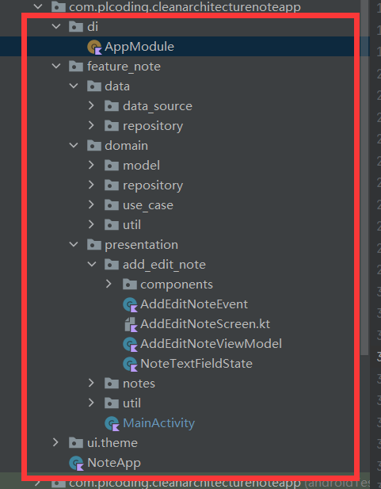

# MVVM结构解析

## di

依赖注入

## feature_note

功能模块包，因为只有一个笔记功能，所以包名叫：**feature_note**

### data

数据来源以及仓库

#### data_source

数据来源

#### repository

数据仓库实例

### domain

业务规则逻辑

#### model

模型实例

#### use_case

用例

#### repository

数据仓库

### presentation

表示层，拥有app当中显示的每个页面

#### notes

笔记主页面

##### components

compose可搭配的组件